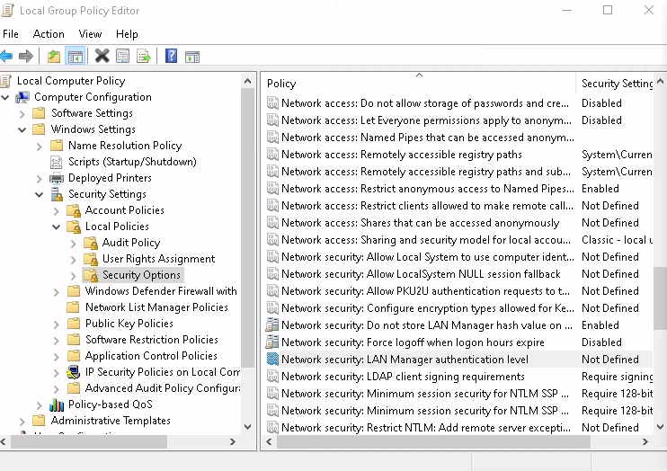
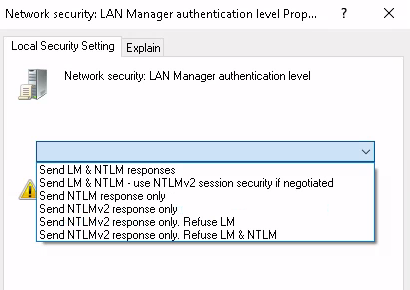

# AD Relay


## NTLM Negotiate Flags

In NTLM relay, we are interested in the following NTLM [Negotiate Flags](https://learn.microsoft.com/en-us/openspecs/windows_protocols/ms-nlmp/99d90ff4-957f-4c8a-80e4-5bfe5a9a9832):
- Always Sign: Requests a session key. It is not used by signing requirements by
  systems that support the Sign flag.
- Sign: Requests signing.


## Is NTLMv1 enabled?

We can find the NTLM configuration in the registry, specifically in the
`LmCompatibilityLevel` value under the
`HKLM\SYSTEM\CurrentControlSet\Control\Lsa` key. It is also possible to check it
in the group policy editor under "Computer Configuration" -> "Windows Settings"
-> "Security Settings" -> "Local Policies" -> "Security Options" ->
"Network Security: LAN Manager authentication level".


<figure  style="text-align:center">
    
    <figcaption><p>Local Group Policy Editor with NTLM option selected</p></figcaption>
</figure>

<figure  style="text-align:center">
    
    <figcaption><p>Network Security: LAN Manager authentication level options</p></figcaption>
</figure>


There are several levels for `LmCompatibilityLevel` (it is a REG_DWORD value):

- **0 = "Send LM & NTLM responses"**: As client, use NTLMv1, including LM
  response. As server accept any auth.
- **1 = "Send LM & NTLM – use NTLMv2 session security if negotiated"**: As
  client use NTLMv1, including LM response, and NTLMv2 session security if it is
  supported by the server. As server accept any auth.
- **2 = "Send NTLM response only"**: As client, use NTLMv1, without LM response,
  and NTLMv2 session security if it is supported by the server. As server accept
  any auth.
- **3 = "Send NTLMv2 response only"**: As client, use NTLMv2. As server accept
  any auth.
- **4 = "Send NTLMv2 response only. Refuse LM"**: As client, use NTLMv2. As
  server, reject LM response.
- **5 = "Send NTLMv2 response only. Refuse LM & NTLM"**: As client, use NTLMv2.
  As server, only accept NTLMv2, reject NTLMv1 and LM response.

We can check `LmCompatibilityLevel` value with the following command:
```
C:\> reg query "HKLM\SYSTEM\CurrentControlSet\Control\Lsa" /v LmCompatibilityLevel


ERROR: The system was unable to find the specified registry key or value.
```

As we can see, by default the `LmCompatibilityLevel` does not exists. In this
case the [default behaviour depends on the system](https://techcommunity.microsoft.com/blog/coreinfrastructureandsecurityblog/active-directory-hardening-series---part-1-%E2%80%93-disabling-ntlmv1/3934787):

- Windows XP | Server 2000: Default is 1 = "Send LM & NTLM – use NTLMv2 session
  security if negotiated"
- Server 2003: Default is 2 = "Send NTLM response only"
- Windows Vista | Server 2008 and higher: Default is 3 = "Send NTLMv2 response
  only"


Additionally, the `BlockNtlmv1SSO` registry value allows to block NTLMv1 from
Windows 11 and Server 2025 machines. Here is an example:
```
PS C:\> reg add "HKLM\SYSTEM\currentcontrolset\control\lsa\msv1_0" /v BlockNtlmv1SSO /t REG_DWORD /d 1
The operation completed successfully.
```


And apart from the NTLM version, we can also check other security parameters used
by NTLM under the `HKLM\SYSTEM\currentcontrolset\control\lsa\msv1_0` registry
key:
```
C:\> reg query "HKLM\SYSTEM\currentcontrolset\control\lsa\msv1_0"

HKEY_LOCAL_MACHINE\SYSTEM\currentcontrolset\control\lsa\msv1_0
    Auth132    REG_SZ    IISSUBA
    NtlmMinClientSec    REG_DWORD    0x20000000
    NtlmMinServerSec    REG_DWORD    0x20000000
```

The `NtlmMinClientSec` and `NtlmMinServerSec` can contain the following flag
values:
- 0x00000010: Message integrity
- 0x00000020: Message confidentiality
- 0x00080000: Require NTLM 2 session security
- 0x20000000: Require 128-bit encryption
- 0x80000000: 56-bit encryption

It is possible to change these values also in group policy, under "Computer
Configuration" -> "Windows Settings" -> "Security Settings" -> "Local Policies"
-> "Security Options":
- "Network security: Minimum session security for NTLM SSP based (including
  secure RPC) clients": `NtlmMinClientSec`
- "Network security: Minimum session security for NTLM SSP based (including
  secure RPC) servers": `NtlmMinServerSec`


Resources:
- 21/09/2023 [Active Directory Hardening Series - Part 1 – Disabling NTLMv1](https://techcommunity.microsoft.com/blog/coreinfrastructureandsecurityblog/active-directory-hardening-series---part-1-%E2%80%93-disabling-ntlmv1/3934787)
  by JerryDevore
- 29/08/2025 [Upcoming changes to NTLMv1 in Windows 11, version 24H2 and Windows Server 2025](https://support.microsoft.com/en-us/topic/upcoming-changes-to-ntlmv1-in-windows-11-version-24h2-and-windows-server-2025-c0554217-cdbc-420f-b47c-e02b2db49b2e)
- [How to enable NTLM 2 authentication](https://learn.microsoft.com/en-us/troubleshoot/windows-client/windows-security/enable-ntlm-2-authentication)


## Is SMBv1 enabled on a machine?

For checking if SMBv1 is enabled from another machine, we can just initiate a
SMB connection that only offers SMBv1 as dialect for SMB (in the
[Negotiate Protocol Request](https://learn.microsoft.com/en-us/openspecs/windows_protocols/ms-cifs/25c8c3c9-58fc-4bb8-aa8f-0272dede84c5)). If the target server rejects the connection,
then SMBv1 is not enabled. Since the SMB dialect is negotiated before any
authentication, no credentials are required to check this.

We can check if SMBv1 is enabled in a machine with `netexec`:
```
$ netexec smb dc01.hack.lab
SMB         192.168.0.1 445    DC01             [*] Windows Server 2022 Build 20348 x64 (name:DC01) (domain:hack.lab) (signing:True) (SMBv1:False)
```

This indicates us that the target machine doesn't support SMBv1 when acting as
server, and in Windows machines, probably neither as a client.


## SMB signing

In regard to SMB, a machine can act as both client or server, in the case of
Windows, there are separate signing options for each role.

We must also take into account that SMB has its own headers to indicate if
signing is required, but it also modifies NTLM headers.

### SMB signing as server

In case of act as an SMB server, we can find the signing options under the
`HKLM\SYSTEM\CurrentControlSet\Services\LanmanServer\Parameters` registry key:
```
C:\>reg query "HKLM\SYSTEM\CurrentControlSet\Services\LanmanServer\Parameters" | findstr /I sign
    enablesecuritysignature    REG_DWORD    0x0
    requiresecuritysignature    REG_DWORD    0x1
```

Depending on these values signing can be enabled (supported) or required
(enforced). Here is the **default configuration** for different kind of Windows
machines as SMB servers:
- **DC** (as SMB server): Enabled=1, Required=1
- **Other**: Enabled=0, Required=0

In a Windows SMB2 server, the signing options are set in field `Security Mode`
of the [Negotiated Protocol Response](https://learn.microsoft.com/en-us/openspecs/windows_protocols/ms-smb2/63abf97c-0d09-47e2-88d6-6bfa552949a5) message, and in the NTLM
authentication, specifically in the [NTLM Challenge message](https://learn.microsoft.com/en-us/openspecs/windows_protocols/ms-nlmp/801a4681-8809-4be9-ab0d-61dcfe762786) inside the
[Negotiate Flags](https://learn.microsoft.com/en-us/openspecs/windows_protocols/ms-nlmp/99d90ff4-957f-4c8a-80e4-5bfe5a9a9832). Here is a table of how this values are set (as server)
based on the system configuration:

| Enabled | Required | SMBv2 Security Mode | NTLM Negotiate Flags |
|---------|----------|---------------------|----------------------|
| 0       | 0        | Enabled             | None                 |
| 1       | 0        | Enabled             | None                 |
| 0       | 1        | Enabled, Required   | Sign, Always Sign    |
| 1       | 1        | Enabled, Required   | Sign, Always Sign    |

As we can see **SMB2 signing is always enabled**, and in case required is set to
one, then both SMBv1 and SMBv2 will enforced it no matter what the enabled value
is.

In a Windows SMBv1 server, the signing options are set in the field `Security Mode` of
of the [Negotiated Protocol Response](https://learn.microsoft.com/en-us/openspecs/windows_protocols/ms-cifs/a4229e1a-8a4e-489a-a2eb-11b7f360e60c) response message, as well as in
NTLM [Negotiate Flags](https://learn.microsoft.com/en-us/openspecs/windows_protocols/ms-nlmp/99d90ff4-957f-4c8a-80e4-5bfe5a9a9832) in the [NTLM Challenge message](https://learn.microsoft.com/en-us/openspecs/windows_protocols/ms-nlmp/801a4681-8809-4be9-ab0d-61dcfe762786). Here are the
values of these messages based on the server configuration:

| Enabled | Required | SMBv1 Security Mode | NTLM Negotiate Flags |
|---------|----------|---------------------|----------------------|
| 0       | 0        | None                | Sign, Always Sign    |
| 1       | 0        | Enabled             | Sign, Always Sign    |
| 0       | 1        | Enabled, Required   | Sign, Always Sign    |
| 1       | 1        | Enabled, Required   | Sign, Always Sign    |

Yeah, I don't understand either XD, since Microsoft has another
[SMB signing matrix](https://learn.microsoft.com/en-us/archive/blogs/josebda/the-basics-of-smb-signing-covering-both-smb1-and-smb2).

Whatever, we can check if SMB signing is required by a server with [netexec](https://github.com/Pennyw0rth/NetExec)
`smb` command:
```
$ netexec smb dc01.hack.lab
SMB         192.168.0.1 445    DC01             [*] Windows Server 2022 Build 20348 x64 (name:DC01) (domain:hack.lab) (signing:True) (SMBv1:False)
```

### SMB signing as client

We can find the configuration of a Windows machine as SMB client in the registry
under the `HKLM\SYSTEM\CurrentControlSet\Services\LanmanWorkstation\Parameters` key:
```
C:\> reg query "HKLM\SYSTEM\CurrentControlSet\Services\LanmanWorkstation\Parameters" | findstr /I sign
    EnableSecuritySignature    REG_DWORD    0x1
    RequireSecuritySignature    REG_DWORD    0x0
```

These are the **default values** for Windows as SMB client:
- **DC**: Enabled=1, Required=0
- **Other**: Enabled=1, Required=0

We can see the SMBv2 client session configuration in the `Security Mode` field
of the [Negotiated Protocol Request](https://learn.microsoft.com/en-us/openspecs/windows_protocols/ms-smb2/e14db7ff-763a-4263-8b10-0c3944f52fc5) message, and we can also check the NTLM
[Negotiate Flags](https://learn.microsoft.com/en-us/openspecs/windows_protocols/ms-nlmp/99d90ff4-957f-4c8a-80e4-5bfe5a9a9832) in the [NTLM Negotiate message](https://learn.microsoft.com/en-us/openspecs/windows_protocols/ms-nlmp/b34032e5-3aae-4bc6-84c3-c6d80eadf7f2). These are the results:

| Enabled | Required | SMBv2 Security Mode | NTLM Negotiate Flags |
|---------|----------|---------------------|----------------------|
| 0       | 0        | Enabled             | Sign, Always Sign    |
| 1       | 0        | Enabled             | Sign, Always Sign    |
| 0       | 1        | Required            | Sign, Always Sign    |
| 1       | 1        | Required            | Sign, Always Sign    |


Alternatively, we should be able to see the SMBv1 client session configuration
in the `Flags2` field of the [Session Setup Andx request](https://.com/en-us/openspecs/windows_protocols/ms-cifs/81e15dee-8fb6-4102-8644-7eaa7ded63f7) message, and we can
also check the NTLM [Negotiate Flags](https://learn.microsoft.com/en-us/openspecs/windows_protocols/ms-nlmp/99d90ff4-957f-4c8a-80e4-5bfe5a9a9832) in the
[NTLM Negotiate message](https://learn.microsoft.com/en-us/openspecs/windows_protocols/ms-nlmp/b34032e5-3aae-4bc6-84c3-c6d80eadf7f2). These are the results:

| Enabled | Required | SMBv1 Session Setup Andx Flags2 | NTLM Negotiate Flags |
|---------|----------|---------------------------------|----------------------|
| 0       | 0        | None                            | Sign, Always Sign    |
| 1       | 0        | None                            | Sign, Always Sign    |
| 0       | 1        | None                            | Sign, Always Sign    |
| 1       | 1        | None                            | Sign, Always Sign    |

From this results I understand that both fields are ignored when negotiating the
signing. In my experience, the signing is only enabled when the server indicates
that is required (in the `Security Mode` field of the
[Negotiated Protocol Request](https://learn.microsoft.com/en-us/openspecs/windows_protocols/ms-smb2/e14db7ff-763a-4263-8b10-0c3944f52fc5) message).


## LDAP signing


In order to provide signing, LDAP don't have a native way of negotiating signing
and relies in the flags of authentication protocol, like NTLM.

Resources:
- [How to enable LDAP signing in Windows Server](https://learn.microsoft.com/en-us/troubleshoot/windows-server/active-directory/enable-ldap-signing-in-windows-server)
- [LDAP Signing Requirements for Active Directory](https://u-tools.com/help/LdapMismatch.asp)

### LDAP signing as server

In Active Directory the LDAP servers we can find are the Domain Controllers. In
those, to check if LDAP signing is required we need to check the value of
`ldapserverintegrity` under the
`HKLM\System\CurrentControlSet\Services\NTDS\Parameters` registry key.

Here is an example in a DC with the default value:
```
C:\> reg query "HKLM\System\CurrentControlSet\Services\NTDS\Parameters" /v ldapserverintegrity

HKEY_LOCAL_MACHINE\System\CurrentControlSet\Services\NTDS\Parameters
    ldapserverintegrity    REG_DWORD    0x1
```

We can find the following LDAP signing levels at a LDAP server:
- 0: Not used
- 1: Not required (default value in DCs)
- 2: Required

We can also detect if signing is required by connecting to the server (domain
credentials required). If signing is required and not specified by the client
via NTLM in authentication, then an LDAP response **strongAuthRequired** is
returned by the LDAP server after NTLM authentication is done.

Therefore, we can check if LDAP signing is required by the server with a simple
LDAP connection (auth required) and monitoring the connection with
wireshark/tshark.

We can initiate the connection with [netexec](https://github.com/Pennyw0rth/NetExec) `ldap` command:
```
$ netexec ldap -u user -p P4ssw0rd -- 192.168.0.1
LDAP        192.168.0.1 389    DC01             [*] Windows Server 2022 Build 20348 (name:DC01) (domain:hack.lab)
LDAPS       192.168.0.1 636    DC01             [+] hack.lab\user:P4ssw0rd
```

And if we monitor, in case ldap signing is enabled, we should
see the `strongAuthRequired` code in LDAP bind response, as in the following
tshark trace:
```
$ tshark -i eth0 -Y 'ldap'
Capturing on 'eth0'
    4 0.001290571 192.168.0.137 → 192.168.0.1 LDAP 143 searchRequest(1717723480) "<ROOT>" baseObject
    5 0.001840231 192.168.0.1 → 192.168.0.137 LDAP 207 searchResEntry(1717723480) "<ROOT>"  | searchResDone(1717723480) success  [1 result]
    7 0.003103228 192.168.0.137 → 192.168.0.1 LDAP 115 bindRequest(354448071) "<ROOT>" , NTLMSSP_NEGOTIATE
    8 0.003788099 192.168.0.1 → 192.168.0.137 LDAP 267 bindResponse(354448071) success , NTLMSSP_CHALLENGE
   13 0.009884305 192.168.0.137 → 192.168.0.1 LDAP 119 bindRequest(932901247) "user" , NTLMSSP_NEGOTIATE
   16 0.010427260 192.168.0.1 → 192.168.0.137 LDAP 267 bindResponse(932901247) success , NTLMSSP_CHALLENGE
   18 0.013861670 192.168.0.137 → 192.168.0.1 LDAP 381 bindRequest(523335393) "user" , NTLMSSP_AUTH, User: hack.lab\user
   19 0.016539976 192.168.0.1 → 192.168.0.137 LDAP 259 bindResponse(523335393) strongAuthRequired (00002028: LdapErr: DSID-0C090254, comment: The server requires binds to turn on integrity checking if SSL\TLS are not already active on the connection, data 0, v4f7c)
```

### LDAP signing as client


LDAP signing levels:
- 0: None
- 1: Negotiate Signing (Default)
- 2: Required Signing

```
C:\> reg query "HKLM\System\CurrentControlSet\Services\LDAP"

HKEY_LOCAL_MACHINE\System\CurrentControlSet\Services\LDAP
    ldapclientintegrity    REG_DWORD    0x1
```

| Signing level       | NTLM Negotiate Flags |
|---------------------|----------------------|
| 0=None              | Always Sign          |
| 1=Negotiate Signing | Sign, Always Sign    |
| 2=Required Signing  | Sign, Always Sign    |

As we can see, the NTLM Sign flag is only set when signing is at least at
"Negotiate signing" level. LDAP servers honors only "Sign" flag and ignores
"Always Sign" for enabling signing.

### LDAP channel binding

Three levels:
- 0: Disabled (Same as key not present -> Default)
- 1: Enabled
- 2: Required

```
C:\> reg query "HKLM\System\CurrentControlSet\Services\NTDS\Parameters" /v LdapEnforceChannelBinding


ERROR: The system was unable to find the specified registry key or value.
```

Resources:
- [KB4034879: Use the LdapEnforceChannelBinding registry entry to make LDAP authentication over SSL/TLS more secure](https://support.microsoft.com/en-us/topic/kb4034879-use-the-ldapenforcechannelbinding-registry-entry-to-make-ldap-authentication-over-ssl-tls-more-secure-e9ecfa27-5e57-8519-6ba3-d2c06b21812e)

## Kerberos Relay


```
/--------Attacker machine-----------\      /----------Victim machine----------\

RemoteKrbRelay             RPCSS                    RPCSS       COM Server
| CoGetInstanceFromIStorage  |                        |              |
|--------------------------->|                        |              |
|                            |  RemoteCreateInstance  |              |
|                            |----------------------->|   Activate   |
|                            |                        |------------->|
|                            |     ResolveOxid2       |<-------------|
|                            |<-----------------------|              |
|                            |                        |              |
|                            | Network & Auth Bindings|              |
|                            |----------------------->|              |
|                            |                        |------------->|
|                            |                        |              |
|                                                                    |
|                            Bind with Kerberos Auth                 |
|<-------------------------------------------------------------------|
|                                                                    |

```

## Resources

- [RemoteKrbRelay (tool)](https://github.com/CICADA8-Research/RemoteKrbRelay) by MzHmO
- [KrbRelay (tool)](https://github.com/cube0x0/KrbRelay) by cube0x0


- 01/04/2020 [NTLM Relay](https://en.hackndo.com/ntlm-relay/) by hackndo
- 20/10/2021 [Windows Exploitation Tricks: Relaying DCOM Authentication](https://googleprojectzero.blogspot.com/2021/10/windows-exploitation-tricks-relaying.html) by
  James Forshaw
- 26/02/2024 [Hello: I’m your ADCS server and I want to authenticate against
  you](https://decoder.cloud/2024/02/26/hello-im-your-adcs-server-and-i-want-to-authenticate-against-you/) by decoder

- 18/04/2024 [CertifiedDCOM: The Privilege Escalation Journey to Domain Admin
  with DCOM](https://blackhat.com/asia-24/briefings/schedule/#certifieddcom--the-privilege-escalation-journey-to-domain-admin-with-dcom-37519) by Tianze Ding

- 04/2025 [The Renaissance of NTLM Relay Attacks:Everything You Need to Know](https://specterops.io/wp-content/uploads/sites/3/2025/04/SPO_NTLM_WhitePaper_Updated.pdf)
  by Elad Shamir
