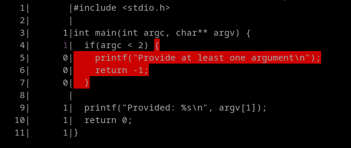

# Fuzzing

## AFL

- [AFL (tool)](https://lcamtuf.coredump.cx/afl/) by Michal Zalewski
- [AFL++ (tool)](https://github.com/AFLplusplus/AFLplusplus) (forked from AFL) by van Hauser, hexcoder-, domenukk,
  andreafioraldi [and others](https://github.com/AFLplusplus/AFLplusplus/graphs/contributors)
- [WinAFL (tool)](https://github.com/googleprojectzero/winafl) (forked from AFL) by Ivan Fratric [and others](https://github.com/googleprojectzero/winafl/graphs/contributors)

AFL tutorials:
- [Fuzzing with AFL workshop](https://github.com/mykter/afl-training)


## LibFuzzer

[LibFuzzer](https://llvm.org/docs/LibFuzzer.html) is a in-process fuzzing engine part of LLVM.

LibFuzzer tutorials:
- [LibFuzzer tutorial](https://github.com/google/fuzzing/blob/master/tutorial/libFuzzerTutorial.md)
- [Structure-Aware Fuzzing with libFuzzer](https://github.com/google/fuzzing/blob/master/docs/structure-aware-fuzzing.md)


In order to use libFuzzer, we need to define a function with the name
`LLVMFuzzerTestOneInput` with the following definition:
```c
#include <stdint.h>

extern "C" int LLVMFuzzerTestOneInput(
    const uint8_t *data,
    size_t size
) {
  invoke_some_lib_function_to_fuzz(data, size);
  return 0;
}
```

Then we need to compile our fuzz target with the `-fsanitize=fuzzer` option,
like the following:
```
clang -g -fsanitize=fuzzer fuzztarget.c lib-to-test.c
```

The `-fsanitize=fuzzer` provides both instrumentation for fuzzing coverage as
well as introduces a `main` definition to generate a program that invokes the
`LLVMFuzzerTestOneInput`. Therefore, appart from the fuzz target, it must be
also used to compile the library to test, since the instrumentation needs to be
included in the library code to monitor it.


## Sanitizers

Sanitizers are tools that allows to monitor programs, usually to detect errors
and malfunctions, but also to know the flow of the program. Many of them work by
instrumenting the program code by inserting instructions in specific sections of
the code, like for example, the beginning of a function. Additionally some of
them, like AddressSanitizer, will check for specific conditions that indicates
error and when found, they will print an output informing of the issue and will
terminate the program.

In case you use a sanitizer with some fuzzer like LibFuzzer or AFL, you must
know that sanitizers are the part that actually crash the program when a bug is
discover. Therefore the use of more error-detection sanitizers may find more
bugs, but will also make the fuzzing process slower.

In clang we have the following sanitizers:
- [AddressSanitizer](https://clang.llvm.org/docs/AddressSanitizer.html) (ASAN): To detect errors in addressable memory.
- [ThreadSanitizer](https://clang.llvm.org/docs/ThreadSanitizer.html): To detect thread races.
- [MemorySanitizer](https://clang.llvm.org/docs/MemorySanitizer.html) (MSAN): To detect errors in uninitialized memory.
- [UndefinedBehaviorSanitizer](https://clang.llvm.org/docs/UndefinedBehaviorSanitizer.html) (UBSAN): To detect undefined behavior like
  using uninitialized variables.
- [DataFlowSanitizer](https://clang.llvm.org/docs/DataFlowSanitizer.html): To monitor data flow.
- [LeakSanitizer](https://clang.llvm.org/docs/LeakSanitizer.html) (LSAN): To detect memory leaks. Can be used alone or as
  part of AddressSanitizer.
- [TypeSanitizer](https://clang.llvm.org/docs/TypeSanitizer.html): To detect type aliasing violations.
- [RealtimeSanitizer](https://clang.llvm.org/docs/RealtimeSanitizer.html): To detect real-time violations in real-time functions.
- [SanitizerCoverage](https://clang.llvm.org/docs/SanitizerCoverage.html): Not really a sanitizer, but a tool used along with
  them to know the code coverage.

### AddressSanitizer

[AddressSanitizer](https://clang.llvm.org/docs/AddressSanitizer.html) (ASAN) is a tool that allows instrument the code generated
with clang(llvm) and gcc, by using the `-fsanitize=address` option (and some
[other compiler options](https://github.com/google/sanitizers/wiki/AddressSanitizerFlags)), to detect memory errors like:

- [Stack buffer overflow](https://github.com/google/sanitizers/wiki/AddressSanitizerExampleStackOutOfBounds)
- [Heap buffer overflow](https://github.com/google/sanitizers/wiki/AddressSanitizerExampleHeapOutOfBounds)
- [Global buffer overflow](https://github.com/google/sanitizers/wiki/AddressSanitizerExampleGlobalOutOfBounds)
- [Use-after-free](https://github.com/google/sanitizers/wiki/AddressSanitizerExampleUseAfterFree)
- [Use-after-return](https://github.com/google/sanitizers/wiki/AddressSanitizerExampleUseAfterReturn)
- [Use-after-scope](https://github.com/google/sanitizers/wiki/AddressSanitizerExampleUseAfterScope)
- Memory leaks (by using [LSAN](https://github.com/google/sanitizers/wiki/AddressSanitizerLeakSanitizer))
- [Initialization order bugs](https://github.com/google/sanitizers/wiki/AddressSanitizerInitializationOrderFiasco)

[How ASAN works?](https://github.com/google/sanitizers/wiki/AddressSanitizerAlgorithm) ASAN will include checks related to the memory in the
generated code. It marks each memory address as poisoned or unpoisoned. If a
program access to a poisoned memory address, the ASAN code will trigger an
error.

In order to monitor what memory is poisoned, ASAN replaces the `malloc`
and `free` functions to track the heap and include code in the functions
prologue and epilogue to track the stack. Besides ASAN uses a shadow memory to
take note of the state of each regular memory address. Each byte of the shadow
memory is correlated with 8 bytes in the regular memory and indicates if those
bytes are poisoned or not.

Each byte of the shadow memory can have the following values:

- A negative value in case the related 8 bytes are poisoned (cannot be accessed).
- A 0 value in case the related 8 regular memory bytes are unpoisoned (they can
  be accessed).

- A positive value `k` that indicates the number of bytes unpoisoned in the
  related 8 regular memory bytes. For example, for `k=5`, the first 5 bytes are
  unpoisoned and the last `8-k = 8-5 = 3` bytes are poisoned.

For example, let's see shadow map in a [heap overflow error](https://github.com/google/sanitizers/wiki/AddressSanitizerExampleHeapOutOfBounds):
```
==6226== ERROR: AddressSanitizer: heap-buffer-overflow on address 0x603e0001fdf4
at pc 0x417f8c bp 0x7fff64c0c010 sp 0x7fff64c0c008
READ of size 4 at 0x603e0001fdf4 thread T0
    #0 0x417f8b in main example_HeapOutOfBounds.cc:5
    #1 0x7fa97c09376c (/lib/x86_64-linux-gnu/libc.so.6+0x2176c)
    #2 0x417e54 (a.out+0x417e54)
0x603e0001fdf4 is located 4 bytes to the right of 400-byte region
[0x603e0001fc60,0x603e0001fdf0)
allocated by thread T0 here:
    #0 0x40d312 in operator new[](unsigned long)
/home/kcc/llvm/projects/compiler-rt/lib/asan/asan_new_delete.cc:46
    #1 0x417f1c in main example_HeapOutOfBounds.cc:3
Shadow bytes around the buggy address:
  0x1c07c0003f60: fa fa fa fa fa fa fa fa fa fa fa fa fa fa fa fa
  0x1c07c0003f70: fa fa fa fa fa fa fa fa fa fa fa fa fa fa fa fa
  0x1c07c0003f80: fa fa fa fa fa fa fa fa fa fa fa fa 00 00 00 00
  0x1c07c0003f90: 00 00 00 00 00 00 00 00 00 00 00 00 00 00 00 00
  0x1c07c0003fa0: 00 00 00 00 00 00 00 00 00 00 00 00 00 00 00 00
=>0x1c07c0003fb0: 00 00 00 00 00 00 00 00 00 00 00 00 00 00[fa]fa
  0x1c07c0003fc0: fa fa fa fa fa fa fa fa fa fa fa fa fa fa fa fa
  0x1c07c0003fd0: fa fa fa fa fa fa fa fa fa fa fa fa fa fa fa fa
  0x1c07c0003fe0: fa fa fa fa fa fa fa fa fa fa fa fa fa fa fa fa
  0x1c07c0003ff0: fa fa fa fa fa fa fa fa fa fa fa fa fa fa fa fa
  0x1c07c0004000: 00 00 00 00 00 00 00 00 00 00 00 00 00 00 00 00
```

We can see that the error is produced in the address `0x603e0001fdf4` that is
mapped to `0x1c07c0003fbe` in the shadow memory, that marked as poisoned the
regular memory as indicated by the negative value `0xfa = -6`, that is after a
zone of unpoisoned memory that is marked with 0.

More info about ASAN in:

- [Clang docs: AddressSanitizer](https://clang.llvm.org/docs/AddressSanitizer.html)
- [google/sanitizers wiki: AddressSanitizer](https://github.com/google/sanitizers/wiki/AddressSanitizer)

### MemorySanitizer

[MemorySanitizer](https://clang.llvm.org/docs/MemorySanitizer.html) (MSAN) is a tool to detect the use of uninitialized memory
in programs compiled with clang(llvm). To include MSAN the `-fsanitize=memory`
option is used when compiling.

Examples of reported errors are:
- Uninitialized value was used in a conditional branch.
- Uninitialized pointer was used for memory accesses.
- Uninitialized value was passed or returned from a function call, which is
  considered an undefined behavior. The check can be disabled with
  `-fno-sanitize-memory-param-retval`.
- Uninitialized data was passed into some libc calls.

Let's see an example. Here is our program with an uninitialized memory access in
the stack:
```c
#include <stdio.h>

int main(int argc, char** argv) {
    int a[5];
    if(a[argc]){
        printf("Nice\n");
    }

    printf("Hello World\n");
    return 0;
}
```

We can then compile it with `-fsanitize=memory` and run it:
```shell
$ clang -fsanitize=memory main.c
$ ./a.out
==3447==WARNING: MemorySanitizer: use-of-uninitialized-value
    #0 0x55555561fec5 in main (/home/ada/a.out+0xcbec5) (BuildId: b30e603af46857c890cbc27bc9000fec4cc8a180)
    #1 0x7ffff7c2a3b7 in __libc_start_call_main csu/../sysdeps/nptl/libc_start_call_main.h:58:16
    #2 0x7ffff7c2a47a in __libc_start_main csu/../csu/libc-start.c:360:3
    #3 0x555555586304 in _start (/home/ada/a.out+0x32304) (BuildId: b30e603af46857c890cbc27bc9000fec4cc8a180)

SUMMARY: MemorySanitizer: use-of-uninitialized-value (/home/ada/a.out+0xcbec5) (BuildId: b30e603af46857c890cbc27bc9000fec4cc8a180) in main
Exiting
```

We can appreciate that the error indicates that there is a uninitialized value
in the `main` function, but not which is the affected variable. To allow
detecting the stack variable, we have to include the
`-fsanitize-memory-track-origins` option.

```shell
$ clang -fsanitize=memory -fsanitize-memory-track-origins  main.c
$ ./a.out
==4845==WARNING: MemorySanitizer: use-of-uninitialized-value
    #0 0x5a221dab2f73 in main (/home/ada/a.out+0xcbf73) (BuildId: 9982ad5c9bc234f0cbfa986700a8fedfc86868a8)
    #1 0x740aaa62a3b7 in __libc_start_call_main csu/../sysdeps/nptl/libc_start_call_main.h:58:16
    #2 0x740aaa62a47a in __libc_start_main csu/../csu/libc-start.c:360:3
    #3 0x5a221da19304 in _start (/home/ada/a.out+0x32304) (BuildId: 9982ad5c9bc234f0cbfa986700a8fedfc86868a8)

  Uninitialized value was created by an allocation of 'a' in the stack frame
    #0 0x5a221dab2eb9 in main (/home/ada/a.out+0xcbeb9) (BuildId: 9982ad5c9bc234f0cbfa986700a8fedfc86868a8)

SUMMARY: MemorySanitizer: use-of-uninitialized-value (/home/ada/a.out+0xcbf73) (BuildId: 9982ad5c9bc234f0cbfa986700a8fedfc86868a8) in main
Exiting
```

Once compiled to track memory origins, we can see that the variable `a` is
identified as source of the uninitialized value.

More information about MSAN:
- [Clang docs: MemorySanitizer](https://clang.llvm.org/docs/MemorySanitizer.html)
- [google/sanitizers wiki: MemorySanitizer](https://github.com/google/sanitizers/wiki/MemorySanitizer)

### UndefinedBehaviorSanitizer

[UndefinedBehaviorSanitizer](https://clang.llvm.org/docs/UndefinedBehaviorSanitizer.html) (UBSAN) is a tool to detect undefined behavior
in a program compiled with clang. To use it we have to specify the
`-fsanitize=undefined` option. Moreover, [specific undefined behavior checks](https://clang.llvm.org/docs/UndefinedBehaviorSanitizer.html#ubsan-checks)
can be enabled individually or in groups.

Some errors detected by USBAN are:
- Out of bounds array access. For arrays whose bounds can be statically
  determined. Example: `int a[5] = { 0 }; a[10] = 1`.
- Bitwise shifts that are out of bounds for their data type. Example:
  `int a = 1; b = a << 48`.
- Dereferencing misaligned or null pointers. Example: `void* a = NULL; b = *a`.
- Signed integer overflow. Example: `int a = 0x7fffffff; a++;`.

### SanitizerCoverage

[SanitizerCoverage](https://clang.llvm.org/docs/SanitizerCoverage.html) instruments the code to indicate which parts/branchs are
being executed. It is used by fuzzers like LibFuzzer to track the coverage of
the inputs.

It works by inserting callbacks to user-defined functions on every function,
basic-block or edge, depending on the [selected granularity level](https://clang.llvm.org/docs/SanitizerCoverage.html#instrumentation-points).

### Source code coverage

[Source-based Code Coverage](https://clang.llvm.org/docs/SourceBasedCodeCoverage.html) allows to visualize which lines of code are
reached in a program execution. We can use clang to create a binary that allows
to analyse source code coverage, which can be pretty useful for understanding
the coverage of our fuzzing inputs.

We can use the following program as example:
```c
#include <stdio.h>

int main(int argc, char** argv) {
  if(argc < 2) {
    printf("Provide at least one argument\n");
    return -1;
  }

  printf("Provided: %s\n", argv[1]);
  return 0;
}
```

First, we need to compile the program with the `-fprofile-instr-generate` (which
will insert instructions to generate a profile) and `-fcoverage-mapping` (which
AFAIK inserts sections with coverage mapping information to allow coverage
analysis) options:
```
clang -fprofile-instr-generate -fcoverage-mapping cov-test.c -o cov-test
```

Then we run the program with the arguments we want to generate the coverage. By
default it will write the coverage data into `default.profraw` file, if we want
to use another file, we can specify it by using the `LLVM_PROFILE_FILE`
environment variable (that admits [special patterns](https://clang.llvm.org/docs/SourceBasedCodeCoverage.html#running-the-instrumented-program)), like the following:
```shell
$ LLVM_PROFILE_FILE=cov-test.profraw ./cov-test Hello
Provided: Hello
```

Once the program is finished, the coverage is written to our raw coverage file
`cov-test.profraw`. A drawback I've found is that if the program terminates by
receiving a signal like Ctrl-C (SIGINT), the coverage file is empty. My guess is
that this happens because the program is finishing in a part that is not
instrumented, so no contents are written to the file. A way to prevent this
issue could be to [handle the signal](https://stackoverflow.com/questions/4217037/catch-ctrl-c-in-c) including some code like the following
that handles a signal (but I've found problems when using it with LibFuzzer):

```c
#include <signal.h>
#include <stdlib.h>

void int_handler(int dummy) {
  exit(-1);
}

int main() {
    //...
    signal(SIGINT, int_handler);
    //...
}
```

Anyway, if the program finished correctly without interruption, a file, or
several in case of multi-process programs, is generated with coverage
information. We can also execute the program several times with different inputs
to produce different `.profraw` files. Then we need to merge/index the
`.profraw` coverage file(s) with the `llvm-profdata merge` command:
```
llvm-profdata merge -sparse cov-test.profraw -o cov-test.profdata
```

Once we have the `.profdata` file that contains all the coverage information of
one or several executions we can use it along with the information in the
program file to print the coverage.

We can start by checking the summary of coverage with `llvm-cov report`:
```shell
$ llvm-cov report -instr-profile cov-test.profdata cov-test
Filename                 Regions    Missed Regions     Cover   Functions  Missed Functions  Executed       Lines      Missed Lines     Cover    Branches   Missed Branches     Cover
------------------------------------------------------------------------------------------------------------------------------------------------------------------------------------
/home/ada/cov-test.c           4                 1    75.00%           1                 0   100.00%           8                 3    62.50%           2                 1    50.00%
------------------------------------------------------------------------------------------------------------------------------------------------------------------------------------
TOTAL                          4                 1    75.00%           1                 0   100.00%           8                 3    62.50%           2                 1    50.00%

```

As we can see, we obtain an output indicating the total coverage of the files
(in this case just one) by region, function, lines and branches. We can
appreciate that not all code was covered in our `cov-test.c` file. In order to
exactly check what code was covered we can use the `show` subcommand:
```
llvm-cov show -instr-profile=cov-test.profdata ./cov-test
```

<figure  style="text-align:center">
    
    <figcaption><p>Source code coverage</p></figcaption>
</figure>

The first column indicates the line number of the file, whereas the second one
is the count of how many times that line was executed. Finally in the code the
red zones indicate the code that <u>was not</u> covered by our program
execution.

We can also get other formats for the output, like an HTML web page:
```
llvm-cov show -instr-profile=cov-test.profdata ./cov-test -format=html >
cov-test.html
```

You can see the result in [cov-test.html](./fuzzing/cov-test.html).

In case we have many files in the coverage output, we can indicate to only print
coverage in specific source files:
```
llvm-cov show -instr-profile=cov-test.profdata ./cov-test -sources /home/ada/cov-test.c
```

Or in functions that contain a given string in their names:
```
llvm-cov show -instr-profile=cov-test.profdata ./cov-test -name main
```

Be aware that in C++ [name mangling](https://stackoverflow.com/questions/1314743/what-is-name-mangling-and-how-does-it-work) is applied so the final function name is
different from the one specified in the source file.


## Structure-aware fuzzing
- [Structure-Aware Fuzzing with libFuzzer](https://github.com/google/fuzzing/blob/master/docs/structure-aware-fuzzing.md)
- [libprotobuf-mutator](https://github.com/google/libprotobuf-mutator)
- [Attacking Chrome IPC: Reliably finding bugs to escape the Chrome sandbox](https://media.ccc.de/v/35c3-9579-attacking_chrome_ipc)
- [Ring Around The Regex: Lessons learned from fuzzing regex libraries (Part
  1)](https://secret.club/2024/06/30/ring-around-the-regex-1.html)
- [arbitrary](https://docs.rs/arbitrary/latest/arbitrary/)

## Dictionaries

- [afl-fuzz: making up grammar with a dictionary in hand](https://lcamtuf.blogspot.com/2015/01/afl-fuzz-making-up-grammar-with.html)
- [AFLplusplus/dictionaries/](https://github.com/AFLplusplus/AFLplusplus/tree/stable/dictionaries)

## OSS-Fuzz

- [OSS-Fuzz](https://github.com/google/oss-fuzz/) by DavidKorczynski, jonathanmetzman, oliverchang [and others](https://github.com/google/oss-fuzz/graphs/contributors)
- [Fuzzing Introspection of OSS-Fuzz projects](https://introspector.oss-fuzz.com/projects-overview "Fuzzing Introspection of OSS-Fuzz projects")
- [OSS-Fuzz Reward Program Rules](https://bughunters.google.com/about/rules/open-source/5097259337383936/oss-fuzz-reward-program-rules)
- [ClusterFuzz (tool)](https://github.com/google/clusterfuzz) by jonathanmetzman, oliverchang, inferno-chromium

## Peach Fuzzer

- [protocol-fuzzer-ce](https://gitlab.com/gitlab-org/security-products/protocol-fuzzer-ce)
- [peach-fuzzer-community (obsolete)](https://gitlab.com/peachtech/peach-fuzzer-community)

## Kernel fuzzing

- [syzkaller (tool)](https://github.com/google/syzkaller) by dvyukov, a-nogikh, xairy [and others](https://github.com/google/syzkaller/graphs/contributors): An
  unsupervised coverage-guided kernel fuzzer.

## Resources

- [Fuzzing Forum](https://github.com/google/fuzzing) by Dor1s [and others](https://github.com/google/fuzzing/graphs/contributors)
- [boofuzz (tool)](https://github.com/jtpereyda/boofuzz) by jtpereyda and SR4ven
  [and others](https://github.com/google/clusterfuzz/graphs/contributors)
- [honggfuzz (tool)](https://github.com/google/honggfuzz) by Robert Swiecki [and others](https://github.com/google/honggfuzz/graphs/contributors)
- [libFuzzer (tool)](https://llvm.org/docs/LibFuzzer.html)
- [litefuzz (tool)](https://github.com/sec-tools/litefuzz) by sec-tools
- [Radamsa (tool)](https://gitlab.com/akihe/radamsa) by Aki Helin
- [fuzztest (tool)](https://github.com/google/fuzztest)

- [Rust Fuzzing Authority: Tools and resources for fuzzing with the Rust
  programming language](https://github.com/rust-fuzz)

- [The Fuzzing Book: Tools and Techniques for Generating Software Tests](https://www.fuzzingbook.org/) by
  Andreas Zeller, Rahul Gopinath, Marcel Böhme, Gordon Fraser, and Christian
  Holler

- [SiliFuzz: Fuzzing CPUs by proxy](https://arxiv.org/abs/2110.11519) by Kostya Serebryany, Maxim Lifantsev,
  Konstantin Shtoyk, Doug Kwan, Peter Hochschild

- [Secret Club: Addison](https://secret.club/author/addison)
- [Earn $200K by fuzzing for a weekend: Part 1](https://secret.club/2022/05/11/fuzzing-solana.html)
- [Ring Around The Regex: Lessons learned from fuzzing regex libraries (Part
  1)](https://secret.club/2024/06/30/ring-around-the-regex-1.html)
- [Ring Around The Regex: Lessons learned from fuzzing regex libraries (Part
  2)](https://secret.club/2024/08/23/ring-around-the-regex-2.html)
