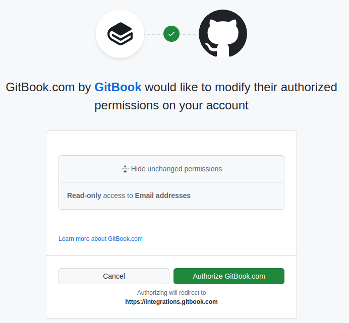

# OAuth 2.0

[OAuth 2.0](https://datatracker.ietf.org/doc/html/rfc6749) is a [widely used](https://en.wikipedia.org/wiki/List_of_OAuth_providers) web authorization framework. It was
created to allow different applications to share resources without
requiring the user to share its credentials with the application that
requests the resources (but as we will see this is not always the
case).

## OAuth roles

In OAuth 2.0 there are four identified roles:

- **Client**: The application that is trying to access to certain
  resources.
- **Resource Owner**: The user to which the resources belong.
- **Resource Server**: The application that holds the resources.
- **Authorization Server**: The server that, after receiving approval
  from the resource owner, grants permissions to the client to access
  the resources provided by the resource server.

There is also another element that can be presented in the OAuth flow:
the **User-Agent**, which is the software used by the user to contact
with the Client and Authorization Server. Usually the User-Agent is a
[web browser](https://en.wikipedia.org/wiki/Web_browser), being the Client a remote web application that runs
on server side, like Gitbook (that will use for the next
example). However, in some scenarios the User-Agent can be the Client
itself, like in the case of a native application like the
[Thunderbird](https://www.thunderbird.net/en-US/) email client or in case the Client is running inside
the User-Agent, like a pure Javascript program that runs inside the
browser with no server side computing or interaction (apart from
download the app files). This last case in known as a User-Agent based
application.

## OAuth example

Let's see an example and understand how the different roles fit into
OAuth. For instance, I have created this document by pushing commits
to a Github repository, and then Gitbook have read the repo and
rendered the contents. For this to happen, I needed to grant
permission to Gitbook to allow it to access to my Github account.

The authorization flow would be something like this (simplified)
example:

- 0.a) I install the Gitbook app into my Github account.
- 0.b) I select in Gitbook that I want to create a new site and select the
  option to integrate it with Github.
- 1) Gitbook redirects me to the Github webpage.
- 2) I log into Github and then Github shows me a message indicating
  that Gitbook wants to access to some of my data. I accept.
- 3) I am redirected back to Gitbook.
- 4) Gitbook is now allowed to access (some of) my Github repos to
  create a site from one of them.

Here is an example of the OAuth prompt present by Github in the second step (after the
proper login):

<figure  style="text-align:center">
    
    <figcaption><p>GitBook OAuth permission request in Github</p></figcaption>
</figure>

In the described scenario <u>Gitbook is the Client</u>, <u>I am the Resource
Owner</u>, and <u>Github is both the Authorization Server</u> (since
allow me to grant permissions) <u>and Resource Server</u> (since it is
the holder of the repository). It is quite common that the
Authorization Server and Resource Server roles are performed by the
same application, but that is not always the case, even if the
Authorization Server needs some kind of coordination with the
Resource Server.

## Client

As we have seen the OAuth 2.0 authorization flow involves many parts,
but maybe the Client is the most relevant,since the OAuth 2.0
framework is defined with aims of providing a secure way for it to
access resources.

In order to get access to the resources, the Client must receive an
Access Token from the Authorization server that, as we will see, is
just an token that must be presented to the Resource Server to get
access to the resources.

However, in order to being able to ask for an Access Token, a client
must be registered into the Authorization Server. The registration
mechanism is not specified by the OAuth 2.0 specification (in the
previous example it was required to install the Gitbook app into
Github), but it must achieve certain goals:

First, it must indicate the Authorization Server which permissions, or
scope, is allowed to being authorized the Client in the Resource
Server. Knowing this will allow the Authorization Server verify that
the Access Token requests are made for the allowed scope, which must
be in the range of what the client can access, but also the Resource
Owner.

Second, providing the Client with a set of credentials to communicate
with the Authorization Server, which are a **Client ID**, to uniquely
identify the Client, and optionally a **Client Secret**, to
authenticate the Client.

The applications that have a Client secret are known as **confidential
clients** and those are usually web applications that are executed in
a remote server, like Gitbook. In contrast, native and User-Agent
based applications aren't supposed to being able to keep their
credentials as a secret, so they only have a Client ID and are known
as **public clients**. Examples of public clients are applications
like Thunderbird.

## OAuth Credentials

### Authorization Grant

The example described above is an example of one of the most common
OAuth 2.0 flow based on the Authorization Code authorization grant.

An **Authorization Grant** is a credential that represents the
Resource Owner authorization to access to its resources. The OAuth 2.0
specification identifies four types:

- **Authorization Code**: A code retrieved from the Authorization Server
  that can be used to request an Access Token. Its specific format is
  not defined.

- **Resource Owner Password**: It is possible to use the Resource Owner
  username and password to directly retrieve an Access Token. This
  grant type is intended to be used by native applications.

- **Implicit**: In this case the Resource Owner retrieves directly an
  Access Token. It is intended for scenarios with limited Clients like
  User-Agent applications.

- **Client Credentials**: The client credentials, usually a Client ID
  and a Client secret, can be used to retrieve an Access Token to
  access to general resources managed by the Resource Server that
  don't really belong to any Resource Owner or do not require its
  approval. This is intended when a Client is not intended to
  represent a Resource Owner agains the Resource Server.

We will see how any of these Authorization Grants are retrieved and
used, but the idea is that any of them can be used to retrieve an
**Access Token** and a optional **Refresh Token**.

Moreover, since Refresh Tokens can also be used to retrieve an Access
Tokens, they are somehow considered another kind of Authorization
Grant.

Additionally, extensions included other grant types. The grant types
included by extensions can be recognize as they are identified by a
complete URI, like the following:

- [urn:ietf:params:oauth:grant-type:device_code](https://datatracker.ietf.org/doc/html/rfc8628)
- [urn:ietf:params:oauth:grant-type:jwt-bearer](https://datatracker.ietf.org/doc/html/rfc7523)
- [urn:ietf:params:oauth:grant-type:saml2-bearer](https://datatracker.ietf.org/doc/html/rfc7522)

### Access Token

An [Access Token](https://datatracker.ietf.org/doc/html/rfc6749#autoid-9) is a short-lived credential used by the Client to
access to protected resources. As we have said, it is given by the
Authorization Server in exchange for an Authorization Grant. Then, the
Access Token can be sent to the Resource Server to access to its
resources.

It is important to know that inside the Access Tokens, the
Authorization Server includes inside the Access Tokens the scope cover
so the Resource Server knows to which resources the Access Token
grants access. This is mainly the reason why OAuth 2.0 is an
authorization framework.

However, the format of the Access Token is not specified in the
[OAuth RFC](https://datatracker.ietf.org/doc/html/rfc6749) (as many other stuff, which has led to [criticism](https://en.wikipedia.org/wiki/OAuth#Controversy)
of the framework), but it must be something that both the
Authorization Server and the Resource Server can understand. It is not
required for the Client to being able to understand or access (can be
encrypted) to the contents of the Access Token, but commonly just a
signed [JWT](https://en.wikipedia.org/wiki/JSON_Web_Token) is used.

### Refresh Token

Refresh tokens issued along with the Access Tokens by the
Authorization Server. They are long lived tokens that can be used to
retrieve a new Access Token once the current one has expired, since
Access Tokens are usually short-lived tokens. It must be noted also
that Refresh Tokens are only intended to be used against the
Authorization Server, whereas Access Tokens are intented to be sent to
the Resource Server.

Other interesting characteristic is that Refresh Tokens also include
the given scope and can be used to retrieve Access Tokens with a
narrower scope.

I guess this can be useful for clients with many different subsystems,
since the cant have well-secured the Refresh Tokens, and then ask for
Access Tokens that can be sent to different subsystems with the
appropiate scope.

## OAuth Endpoints

In order to make requests for the Authorization Grants and the tokens,
the Authorization Server must publish two endpoints:

- **Authorization endpoint**: It is used to request Authorization
  Grants, usually through an User-Agent redirection initiated by the
  Client. No specific endpoint direction is specified in OAuth 2.0,
  but a common one is `/authorize`.

- **Token endpoint**: The endpoint used by the Client to request
  Access Tokens. No specific endpoint direction is specified in OAuth 2.0,
  but a common one is `/token`.

On the other hand, since the Authorization Grants must be returned to
Client via an redirection or similar method, the Client must also
define one endpoint:

- **Redirection Endpoint**: The endpoint that will be used to send the
  Authorization Grant to the Client. It could be registered in the
  Authorization Server, but must be send in the authorization request,
  as many redirection endpoints can be registered. It is important
  that the Authorization Server verifies the redirection endpoint
  properly in order to assure that is not pointed to a non related
  domain controlled by an attacker.

Here is a schema of the [general protocol flow](https://datatracker.ietf.org/doc/html/rfc6749#section-1.2):
```
  .--------.                               .----------.
  |        |>--1) Authorization Request--->|          |
  |        |     + client id               | Resource |
  |        |                               |  Owner   |
  |        |<--2) Authorization Response--<|          |
  |        |     + authorization grant     '----------'
  |        |
  |        |
  |        |                             .---------------.
  |        |>--3) Token Request--------->|               |
  | Client |     + client id             | Authorization |
  |        |     + authorization grant   |    Server     |
  |        |                             |               |
  |        |<--4) Token Response--------<|               |
  |        |     + access token          '---------------'
  |        |     (+ refresh token)
  |        |
  |        |                          .----------.
  |        |>--5) Resource Request--->|          |
  |        |       + access token     | Resource |
  |        |                          |  Server  |
  |        |<--6) Resource Response--<|          |
  '--------'                          '----------'
```

## OAuth flows

As we have mentioned, the OAuth 2.0 framework has many different types
of grants, which are usually intended to be used by different types of
clients. Now let's see how the different Authorization Grant types can
be used.

### Authorization Code flow

The flow used in the example belongs to the Authorization Code flow,
which is the most complex flow described in OAuth core specification,
so if you get it, everything should be smoother from here.

The Authorization Code is meant to be used by a web application
executing in a remote server. Thus, it avoids the Resource Owner from
sending her credentials to the Client and instead, it sends an
Authorization Code that can be used to receive an Access Token, which
in turn can be used to request access to the desired resources.

Here is the Authorization Code flow schema:
```
                          Resource Owner
                                \O/
                                 |
                                / \
                          .------------.
  .--1a) Authz request--> |            | >-1b) Authz request-----.
  |      + client_id      |            |      + client_id        |
  |      + redirect_uri   |            |      + redirect_uri     |
  |                       | User-Agent |                         |
  |                       |            | <-2) Authentication--.  |
  |                       |            |                      |  |
  |  .-3b) Authz resp---< |            | <-3a) Authz resp--.  |  |
  |  |    + code          '------------'      + code       |  |  |
  v  ^                                                     ^  v  v
 .--------.                                    .----------------------.
 |        | >---4) Token request-------------> |                      |
 |        |       + code                       |                      |
 |        |       + client_id                  |                      |
 | Client |       (+ client secret)            | Authorization Server |
 |        |       + redirect_uri               |                      |
 |        |                                    |                      |
 |        | <--5) Token response-------------< |                      |
 '--------'         + access_token             '----------------------'
    ^  v         (+ refresh_token)
    |  |
    |  |                        .-----------------.
    |  '--6) Resource request-->|                 |
	|       + access_token      | Resource Server |
    |                           |                 |
    '---7) Resource response--< |                 |
                                '-----------------'
```


1. The Client indicates the User-Agent to make a request to the
   authorization endpoint of the Authorization Server, with the
   provided parameters, which include the Client ID to identify the
   client and a redirection URI to which the Authorization Server will
   send the response. This is usually done through a HTTP redirection
   to an URL that includes the parameters in the query part. Here is an
   example of request:

   ```
   GET /authorize?response_type=code&client_id=s6BhdRkqt3&state=xyz
        &redirect_uri=https%3A%2F%2Fclient%2Eexample%2Ecom%2Fcb HTTP/1.1
   Host: authorization.example.com
   ```

2. If required, the Authorization Server authenticates the Resource
   Owner. In some cases, like the when User-Agent already provides a
   session cookie in the authorization request, authentication is not
   necessary (as it has already been done).

3. The Authorization Server responds by issuing an Authorization Code
   that will be sent to the Client redirection endpoint by some mean,
   like an HTTP redirection or a form that is usually auto submit with
   Javascript. Here is an example of response:

   ```
   HTTP/1.1 302 Found
   Location: https://client.example.com/cb?code=SplxlOBeZQQYbYS6WxSbIA
             &state=xyz
   ```

4. Once received the code, the Client, usually in its backend, sends
   an HTTP request to retrieve an Access Token. It needs to include
   its own credentials, which in this case usually includes a Client
   Secret.

   ```
   POST /token HTTP/1.1
   Host: authorization.example.com
   Content-Type: application/x-www-form-urlencoded

   grant_type=authorization_code&code=SplxlOBeZQQYbYS6WxSbIA
   &redirect_uri=https%3A%2F%2Fclient%2Eexample%2Ecom%2Fcb
   &client_id=s6BhdRkqt3&client_secret=gX1fBat3bV
   ```

5. After verifying that everything is correct, the Authorization
   Server sends back an Access Token and optionally a Refresh Token
   along with relevant information such the type of token issued and
   the lifetime.

   ```
   HTTP/1.1 200 OK
   Content-Type: application/json;charset=UTF-8

   {
     "access_token":"2YotnFZFEjr1zCsicMWpAA",
     "token_type":"Bearer",
     "expires_in":3600,
     "refresh_token":"tGzv3JOkF0XG5Qx2TlKWIA",
   }
   ```

6. Then the Client sends a request to the Resource Server that
   includes the Access Token. For example, in case of being a Bearer
   token a request like the following could be send:

   ```
   GET /resource
   Host: resources.example.com
   Authentication : Bearer 2YotnFZFEjr1zCsicMWpAA

   ```

7. If everything is correct, the Resource Server returns the resource.

### Implicit flow

The Implicit flow is similar to the Authorization Code flow, but a the
Resource Owner just returns the Access Token instead of a code. This
flow is intended to be carried out by some User-Agent based
application which has no way to retrieve the Access Token from the
backend.

The Implicit flow schema:
```
                          Resource Owner
                                \O/
                                 |
                                / \
                          .------------.
  .--1a) Authz request--> |            | >-1b) Authz request-------.
  |      + client_id      |            |      + client_id          |
  |      + redirect_uri   |            |      + redirect_uri       |
  |                       | User-Agent |                           |
  |                       |            | <-2) Authentication----.  |
  |                       |            |                        |  |
  |  .-3b) Authz resp---< |            | <-3a) Authz resp----.  |  |
  |  |    + access_token  '------------'      + access_token |  |  |
  v  ^                                                       ^  v  v
 .--------.                                    .----------------------.
 |        |                                    |                      |
 |        |                                    |                      |
 |        |                                    |                      |
 | Client |                                    | Authorization Server |
 |        |                                    |                      |
 |        |                                    |                      |
 |        |                                    |                      |
 '--------'                                    '----------------------'
    ^  v
    |  |
    |  |                        .-----------------.
    |  '--4) Resource request-->|                 |
	|       + access_token      | Resource Server |
    |                           |                 |
    '---5) Resource response--< |                 |
                                '-----------------'
```

1. The Client indicates the User-Agent to make a request to the
   authorization endpoint of the Authorization Server, with the
   provided parameters, which include the Client ID to identify the
   client and a redirection URI to which the Authorization Server will
   send the response. This is usually done through a HTTP redirection
   to an URL that includes the parameters in the query part. Here is an
   example of request:

   ```
   GET /authorize?response_type=token&client_id=s6BhdRkqt3&state=xyz
        &redirect_uri=https%3A%2F%2Fclient%2Eexample%2Ecom%2Fcb HTTP/1.1
   Host: authorization.example.com
   ```

   Be aware that if an attacker enters a fake the redirection endpoint
   controlled by her and the Authorization Server don't verifies it
   well enough, it could compromise the security since the attacker
   will be able to receive an Access Token.

2. If required, the Authorization Server authenticates the Resource
   Owner. In some cases, like the when User-Agent already provides a
   session cookie in the authorization request, authentication is not
   necessary (as it has already been done).

3. The Authorization Server responds by issuing an Authorization Code
   that will be sent to the Client redirection endpoint by some mean,
   like an HTTP redirection or a form that is usually auto submit with
   Javascript. Here is an example of response:

   ```
   HTTP/1.1 302 Found
   Location: https://client.example.com/cb#access_token=2YotnFZFEjr1zCsicMWpAA
               &state=xyz&token_type=example&expires_in=3600
   ```

4. Then the Client sends a request to the Resource Server that
   includes the Access Token. For example, in case of being a Bearer
   token a request like the following could be send:

   ```
   GET /resource
   Host: resources.example.com
   Authentication : Bearer 2YotnFZFEjr1zCsicMWpAA

   ```

5. If everything is correct, the Resource Server returns the resource.

### Resource Owner Password Credentials flow

The Resource Owner Password Credentials flow is quite straightforward
since the request to the Authorization endpoint is not made, and the
Client just sends the Resource Owner username and password to retrieve
an Access Token.

This approach is intended for being used by native applications like
Thunderbird that have a direct relation with the user since they are
executed in her device.

Here is the flow schema:
```
 Resource Owner
    \O/
     |
    / \
 .--------.                                    .----------------------.
 |        | >---1) Token request-------------> |                      |
 |        |       + username                   |                      |
 |        |       + password                   |                      |
 | Client |       + client_id                  | Authorization Server |
 |        |       (+ client_secret)            |                      |
 |        |                                    |                      |
 |        | <--2) Token response-------------< |                      |
 '--------'      + access_token                '----------------------'
    ^  v         (+ refresh_token)
    |  |
    |  |                        .-----------------.
    |  '--3) Resource request-->|                 |
	|       + access_token      | Resource Server |
    |                           |                 |
    '---4) Resource response--< |                 |
                                '-----------------'
```

The steps are the following:

1. The Client sends the Resource owner username and password along
   with its own credentials to the token endpoint.

   ```
   POST /token HTTP/1.1
   Host: authorization.example.com
   Content-Type: application/x-www-form-urlencoded

   grant_type=password&username=johndoe&password=A3ddj3w
   &client_id=s6BhdRkqt3&client_secret=gX1fBat3bV
   ```

2. After verifying that everything is correct, the Authorization
   Server sends back an Access Token and optionally a Refresh Token
   along with relevant information such the type of token issued and
   the lifetime.

   ```
   HTTP/1.1 200 OK
   Content-Type: application/json;charset=UTF-8

   {
     "access_token":"2YotnFZFEjr1zCsicMWpAA",
     "token_type":"Bearer",
     "expires_in":3600,
     "refresh_token":"tGzv3JOkF0XG5Qx2TlKWIA",
   }
   ```

3. The Client uses the Access Token to request access to the Resource
   Server resources.

   ```
   GET /resource
   Host: resources.example.com
   Authentication : Bearer 2YotnFZFEjr1zCsicMWpAA

   ```

4. The Resource Server grants access to the requested resource in case
   everything is ok in the Access Token.


### Client Credentials flow

The client credentials flow is intended to be used to receive Access
Tokens that are issued to the Client application by its own
permissions, not in behalf of an user.

It is usually intended for confidential clients, but nothing stops a
public client from using the Client Credentials grant type.

Here is the schema of this flow:
```
 .--------.                                    .----------------------.
 |        | >---1) Token request-------------> |                      |
 |        |       + client_id                  |                      |
 |        |       (+ client_secret)            |                      |
 | Client |                                    | Authorization Server |
 |        |                                    |                      |
 |        |                                    |                      |
 |        | <--2) Token response-------------< |                      |
 '--------'      + access_token                '----------------------'
    ^  v         (+ refresh_token)
    |  |
    |  |                        .-----------------.
    |  '--3) Resource request-->|                 |
	|       + access_token      | Resource Server |
    |                           |                 |
    '---4) Resource response--< |                 |
                                '-----------------'
```

The steps are the following:

1. The Client just use its own credentials in the token endpoint.
   ```
   POST /token HTTP/1.1
   Host: authorization.example.com
   Content-Type: application/x-www-form-urlencoded

   grant_type=client_credentials&client_id=s6BhdRkqt3&client_secret=gX1fBat3bV
   ```

2. After verifying that everything is correct, the Authorization
   Server sends back an Access Token and optionally a Refresh Token
   along with relevant information such the type of token issued and
   the lifetime.

   ```
   HTTP/1.1 200 OK
   Content-Type: application/json;charset=UTF-8

   {
     "access_token":"2YotnFZFEjr1zCsicMWpAA",
     "token_type":"Bearer",
     "expires_in":3600,
     "refresh_token":"tGzv3JOkF0XG5Qx2TlKWIA",
   }
   ```

3. The Client uses the Access Token to request access to the Resource
   Server resources.

   ```
   GET /resource
   Host: resources.example.com
   Authentication : Bearer 2YotnFZFEjr1zCsicMWpAA

   ```

4. The Resource Server grants access to the requested resource in case
   everything is ok in the Access Token.


## OAuth 2.0 Extensions

### Open ID Connect

[Open ID Connect](https://openid.net/specs/openid-connect-core-1_0.html) (OIDC) is an OAuth 2.0 extension that allows to
use OAuth 2.0 to perform user/Resource Owner authentication into the
Client. It does this by introducing a new kind of token, the ID token,
that is returned by the Authorization Server and includes information
about the user.

#### ID Token

The ID token is a JWT token introduced by OIDC whose purpose is to
return information about the user so the Client can verified its
identity.

The main difference with the Access Token is that the ID Token final
destination is the Client itself, not the Resource Server. Moreover,
the Access Token contains scope information while the ID Token just
contains information about the end-user.

#### UserInfo endpoint

The OIDC extension also introduces in the Authorization Server an
UserInfo endpoint to retrieve claims about the user. No endpoint
location is defined, but the examples use the `/userinfo` path.

#### Open ID Connect flow

The OIDC extension doesn't propose a new flow or grant type, but reuse
the ones defined in OAuth 2.0. Let's view the example of OIDC being
used with an Authentication Code flow:
```
                          Resource Owner
                                \O/
                                 |
                                / \
                          .------------.
  .--1a) Authz request--> |            | >-1b) Authz request-----.
  |      + client_id      |            |      + client_id        |
  |      + redirect_uri   |            |      + redirect_uri     |
  |                       | User-Agent |                         |
  |                       |            | <-2) Authentication--.  |
  |                       |            |                      |  |
  |  .-3b) Authz resp---< |            | <-3a) Authz resp--.  |  |
  |  |    + code         '------------'       + code       |  |  |
  v  ^                                                     ^  v  v
 .--------.                                    .----------------------.
 |        | >---4) Token request-------------> |                      |
 |        |       + grant                      |                      |
 |        |       + client_id                  |                      |
 |        |       (+ client secret)            |                      |
 |        |       + redirect_uri               |                      |
 |        |                                    |                      |
 |        | <--5) Token response-------------< |                      |
 |        |      + id_token                    |                      |
 | Client |      + access_token                | Authorization Server |
 |        |     (+ refresh_token)              |                      |
 |        |                                    |                      |
 |        |                                    |                      |
 |        | >---6) UserInfo request----------> |                      |
 |        |       + access_token               |                      |
 |        |                                    |                      |
 |        | <--7) UserInfo response----------< |                      |
 |        |      + claims                      |                      |
 '--------'                                    '----------------------'

```

1. The Client indicates the User-Agent to make a request to the
   authorization endpoint of the Authorization Server, with the
   provided parameters, which include the Client ID to identify the
   client and a redirection URI to which the Authorization Server will
   send the response, as well as the `openid` scope. This is usually
   done through a HTTP redirection to an URL that includes the
   parameters in the query part. Here is an example of request:

   ```
   GET /authorize?response_type=code&scope=openid%20profile%20email
       &client_id=s6BhdRkqt3&state=af0ifjsldkj
       &redirect_uri=https%3A%2F%2Fclient.example.org%2Fcb HTTP/1.1
   Host: authorization.example.com
   ```
   
2. If required, the Authorization Server authenticates the Resource
   Owner. In some cases, like the when User-Agent already provides a
   session cookie in the authorization request, authentication is not
   necessary (as it has already been done).

3. The Authorization Server responds by issuing an Authorization Code
   that will be sent to the Client redirection endpoint by some mean,
   like an HTTP redirection or a form that is usually auto submit with
   Javascript. Here is an example of response:

   ```
   HTTP/1.1 302 Found
   Location: https://client.example.com/cb?code=SplxlOBeZQQYbYS6WxSbIA
             &state=af0ifjsldkj
   ```
   
4. Once received the code, the Client, usually in its backend, sends
   an HTTP request to retrieve an Access Token. It needs to include
   its own credentials, which in this case usually includes a Client
   Secret.

   ```
   POST /token HTTP/1.1
   Host: authorization.example.com
   Content-Type: application/x-www-form-urlencoded

   grant_type=authorization_code&code=SplxlOBeZQQYbYS6WxSbIA
   &redirect_uri=https%3A%2F%2Fclient%2Eexample%2Ecom%2Fcb
   &client_id=s6BhdRkqt3&client_secret=gX1fBat3bV
   ```
   
5. After verifying that everything is correct, the Authorization
   Server sends back an ID token, an Access Token and optionally a
   Refresh Token along with relevant information such the type of
   token issued and the lifetime.

   ```
   HTTP/1.1 200 OK
   Content-Type: application/json;charset=UTF-8

   {
     "access_token": "SlAV32hkKG",
     "token_type": "Bearer",
     "refresh_token": "8xLOxBtZp8",
     "expires_in": 3600,
     "id_token": "eyJhbGciOiJSUzI1NiIsImtpZCI6IjFlOWdkazcifQ.ewogImlzc
       yI6ICJodHRwOi8vc2VydmVyLmV4YW1wbGUuY29tIiwKICJzdWIiOiAiMjQ4Mjg5
       NzYxMDAxIiwKICJhdWQiOiAiczZCaGRSa3F0MyIsCiAibm9uY2UiOiAibi0wUzZ
       fV3pBMk1qIiwKICJleHAiOiAxMzExMjgxOTcwLAogImlhdCI6IDEzMTEyODA5Nz
       AKfQ.ggW8hZ1EuVLuxNuuIJKX_V8a_OMXzR0EHR9R6jgdqrOOF4daGU96Sr_P6q
       Jp6IcmD3HP99Obi1PRs-cwh3LO-p146waJ8IhehcwL7F09JdijmBqkvPeB2T9CJ
       NqeGpe-gccMg4vfKjkM8FcGvnzZUN4_KSP0aAp1tOJ1zZwgjxqGByKHiOtX7Tpd
       QyHE5lcMiKPXfEIQILVq0pc_E2DzL7emopWoaoZTF_m0_N0YzFC6g6EJbOEoRoS
       K5hoDalrcvRYLSrQAZZKflyuVCyixEoV9GfNQC3_osjzw2PAithfubEEBLuVVk4
       XUVrWOLrLl0nx7RkKU8NXNHq-rvKMzqg"
    }
   ```
   
   Since it is a JWT, we can decode the ID token:
   ```json
   {
     "iss": "http://authorization.example.com",
     "sub": "248289761001",
     "aud": "s6BhdRkqt3",
     "nonce": "n-0S6_WzA2Mj",
     "exp": 1311281970,
     "iat": 1311280970
   }
   ```
   
6. Once an Access Token is retrieved, the Client can request also user
   info from the UserInfo endpoint in Authorization Server.
   
   ```
   GET /userinfo HTTP/1.1
   Host: authorization.example.com
   Authorization: Bearer SlAV32hkKG
   ```

7. The Authorization Server will return the proper user information if
   everything is correct in the request.
   
   ```
   HTTP/1.1 200 OK
   Content-Type: application/json

   {
     "sub": "248289761001",
     "name": "Ada Lovelace",
     "given_name": "Ada",
     "family_name": "Lovelace",
     "preferred_username": "ada",
     "email": "ada@example.com",
     "picture": "https://example.com/ada/me.jpg"
   }
   ```


## Resources

- [RFC6749: The OAuth 2.0 Authorization Framework](https://datatracker.ietf.org/doc/html/rfc6749)
